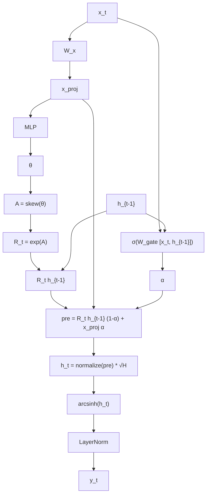

# Geometric RNN Architecture

## 1. Computational Graph

The `GeometricRNNCell` updates the hidden state using orthogonal transformations and a gating mechanism. 

## 2. Mathematical Formulation

At each time step $t$, the forward pass is defined by the following operations:

**1. Projection:**

$$
x_{proj} = W_x x_t
$$

**2. Rotor Generation:**

$$
\theta = \mathrm{MLP}(x_{proj})
$$

$$
A = \mathrm{skew}(\theta)
$$

$$
R_t = \exp(A)
$$

**3. Gating:**

$$
\alpha = \sigma(W_{gate} [x_t, h_{t-1}])
$$

**4. State Update:**

$$
pre = (R_t h_{t-1}) \odot (1 - \alpha) + x_{proj} \odot \alpha
$$

$$
h_t = \frac{pre}{\|pre\|_2} \sqrt{H}
$$

**5. Output:**

$$
y_t = \mathrm{LayerNorm}(\mathrm{arcsinh}(h_t))
$$

*Note: $H$ denotes the hidden dimension size. The matrix $A$ is skew-symmetric, ensuring $R_t$ is an orthogonal rotation matrix.*

## 3. Parallel Gradient Computation (ParaRNN)

The model supports a parallel backward pass to mitigate the $O(T)$ sequential bottleneck of standard RNNs. 

During the forward pass, projections $X_{proj}$ and rotation matrices $R_{1:T}$ are computed in parallel for the entire sequence. During the backward pass, the gradients $\frac{\partial L}{\partial h_t}$ are computed using a parallel scan (prefix sum) over the dense Jacobians. This reduces the backward time complexity from $O(T)$ to $O(\log T)$
